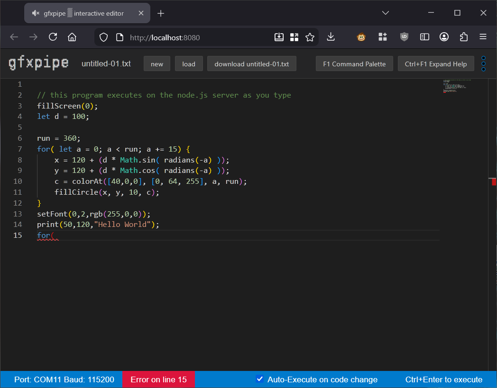
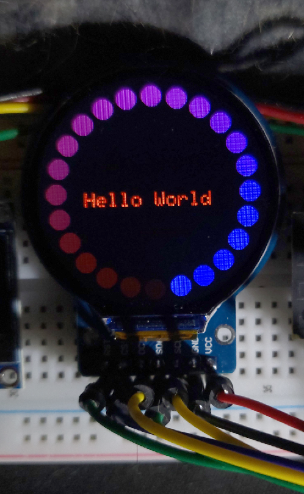
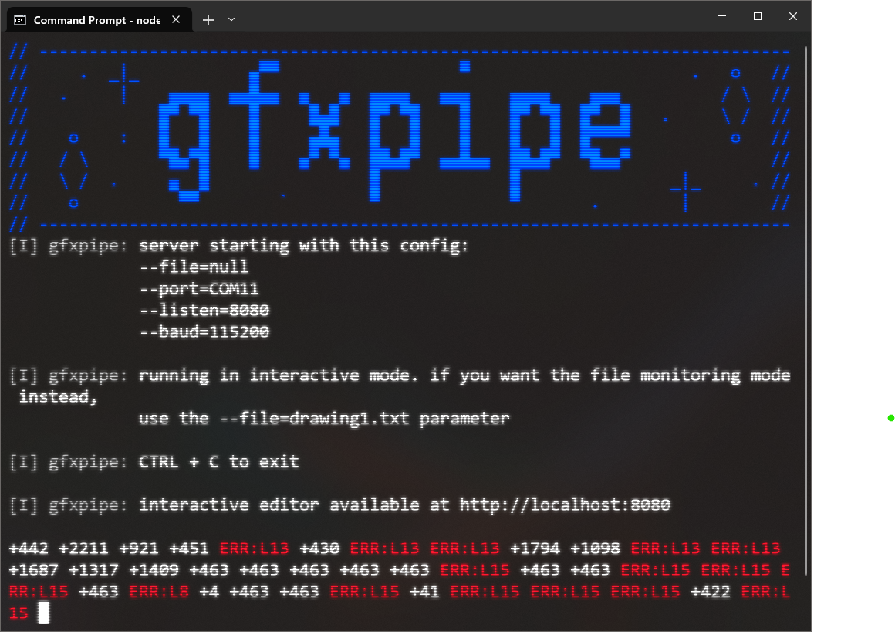

**gfxpipe** is a draw-command streaming pipeline for Arduino-based displays built on the **Adafruit_GFX** library.

This project lets you prototype UI and graphics in near-realtime using familiar Adafruit_GFX calls without needing to recompile or flash firmware for every visual tweak.  When you're happy with your UI, rewrite it for speed in C/C++.

<table border="0">
  <tr>
    <td width="67%" valign="top" align="left">
      <b>1. Write Adafruit_GFX - style code in the Browser</b>  
      
        Live JavaScript REPL runs on your local Node.js server, encoding standard Adafruit_GFX calls as you type. Available commands are mapped in a VM sandbox definition in server.js.
      
    </td>
    <td width="33%" valign="top" align="left">
      <b>2. See Instant Results</b>  
      
        Encoded draw commands stream directly to the connected display via serial port (GC9A01 shown).
      
    </td>
  </tr>
  <tr>
    <td width="67%" valign="top" align="left">
      
    </td>
    <td width="33%" valign="top" align="left">
      
    </td>
  </tr>
  <tr>
    <td width="67%" valign="top" align="left" colspan="2">
      Tested with Arduino nano, ESP32-S3 and GC9A01A / SSD1306 displays.
    </td>
  </tr>
</table>

## Breakdown

This project comes in three parts:

|   | File        | Function           | Description                                           |
|---|-------------|--------------------|-------------------------------------------------------|
| 1 | gfxpipe.ino | Arduino firmware   | Lets Arduino listen to serial port draw commands      |
| 2 | server.js   | Node.js server     | Connects to Arduino via COM port, sends draw commands |
| 3 | editor.html | Interactive Editor | Simulates Adafruit_GFX commands in JavaScript         |

## 1 - gfxpipe.ino

To get started, connect your display device as you normally would to your Arduino, and then edit config.h to make it work.  Config.h contains three sections - communication settings, display settings, and any fonts you might be using.

Communication settings mainly lets you set the BAUD rate.

Display settings consist of 3 macro blocks of code that execute at a global declaration level, `setup()`, and `loop()`.  There are two example config.h variations for a GC9A01A on an ESP32-S3 and a SSD1306 device on Arduino Nano, but roughly they look like this:

Declared before setup:

    #define YOUR_DISPLAY_DECLARATION_CODE \
        Adafruit_GC9A01A display_device(TFT_CS, TFT_DC, TFT_RST); \
        GFXcanvas16 display_canvas(240, 240);

Runs in setup:

    #define YOUR_DISPLAY_SETUP_CODE \
        SPI.begin(TFT_SCK, -1, TFT_MOSI, TFT_CS); \
        display_device.begin(80000000); \
        display_device.setRotation(0);

Runs at end of loop() at set display rate (`Z` instruction):

    #define YOUR_DISPLAY_CALL \
        display_device.drawRGBBitmap(0, 0, display_canvas.getBuffer(), 240, 240);

The firmware is completly unaware of what you are doing with these but it does expect `display_device` to be defined and accessible so it can call Adafruit_GFX commands on it.  You can however structure it for double buffering like the example shows.

If everything is working at this point you can just connect the Arduino, fire up the the Arduino IDE's Serial Monitor and you'll be seeing `.` messages every 5 seconds.  If that's the case, you can issue raw draw commands by typing them in the Serial Monitor:

* `F,0` will clear screen to black.
* `L,0,0,120,120,255` will draw a line from 0,0 to 120,120 in blue.
* `W,1,32,Hello` will print text at 1,32.

Full list of encoded draw commands is located at the bottom of this README.

## 2 - server.js

To get started, run `npm install` and then run `node server.js --port=COM1 --baud=115200 --listen=8080`

The node program should connect to the Arduino, and listen for echo commands from it every 5 - 10 seconds. 

  

This server.js  program offers two operating modes: file monitoring mode and an interactive web-based editor. Both modes use rudimentary flow control to send queued draw commands and the Arduino will acknowledge their execution with a `.` reply.

### File monitoring mode

This is available to you in case you want to use another programming language to write encoded draw commands to a file and have server.js monitor for changes and transmit it to the Arduino.  

`node server.js --port=COM1 --baud=115200 --file=drawing.txt`

Alternatively, you can use this mode to stream data from a Python script, system monitor or a few lines of bash.

`echo "L,0,0,10,10,255" >> drawing.txt`

Full list of encoded draw commands is located at the bottom of this README.

## 3 - Interactive Editor

As shown in the top screenshot, you can write code in JavaScript using what looks like familiar Adafruit_GFX functions and they'll get transmitted to the Arduino as you type.

This mode is meant for prototyping layouts fast and making visual tuning before comitting to rewriting this in C/C++ for your project.

`node server.js --port=COM1 --baud=115200 --listen=8080`

That will run a web server on port 8080 and serve a Monaco-powered REPL editor which executes sandboxed commands in a VM in near-realtime.  The console status shows either how many bytes have been transmitted to the Arduino every second of activity, or error on a particular line of code while you're mid-edit.

The VM sandbox only allows a handful of commands and has a hardcoded execution limit of 100 ms.

## Commands available to JavaScript editor:

This list is also shown in the interactive editor and the level of help detail can be toggled with Ctrl+F1.

| command       |  parameters                            | type             | info
|---------------|----------------------------------------|------------------|-----
| setRate       | (miliseconds)                          | firmware_setting | sets how frequently arduino draws the screen
| console.info  | text                                   | helper           | displays custom log messages on node server console
| rgb           | (r, g, b)                              | helper           | convert R,G,B to 16-bit 5-6-5 color
| colorAt       | ([r, g, b], [r, g, b], current, total) | helper           | interpolates color gradient between two colors, at current/total position.
| radians       | (deg)                                  | helper           | converts degrees to radians
| degrees       | (rad)                                  | helper           | converts radians to degrees
| fillScreen    | (color)                                | Adafruit_GFX     |
| drawPixel     | (x, y, color)                          | Adafruit_GFX     | 
| drawLine      | (x1, y1, x2, y2, color)                | Adafruit_GFX     | 
| drawRect      | (x, y, w, h, color)                    | Adafruit_GFX     | 
| fillRect      | (x, y, w, h, color)                    | Adafruit_GFX     | 
| drawCircle    | (x, y, r, color)                       | Adafruit_GFX     |
| fillCircle    | (x, y, r, color)                       | Adafruit_GFX     |
| drawEllipse   | (x, y, w, h, color)                    | Adafruit_GFX     |
| fillEllipse   | (x, y, w, h, color)                    | Adafruit_GFX     |
| drawRoundRect | (x, y, w, h, r, color)                 | Adafruit_GFX     |
| fillRoundRect | (x, y, w, h, r, color)                 | Adafruit_GFX     |
| drawTriangle  | (x1, y1, x2, y2, x3, y3, color)        | Adafruit_GFX     |
| fillTriangle  | (x1, y1, x2, y2, x3, y3, color)        | Adafruit_GFX     |
| setFont       | (index, size, color)                   | hybrid           | picks indexed font (configured in config.h) sets size and color all at once
| print         | (x, y, text)                           | hybrid           | sets cursor and writes text all at once

For black and white displays, colors are 0 (black), 1 (on), and usually 2 (invert).

## Raw Commands/Encoding:

Instead of bothering with the interactive editor, you can craft raw instructions in any language to be transmitted to the arduino, and run `server.js --file=drawing.txt` mode where it will monitor for changes and send.  Or write your own serial port transmission program.

This protocol is not super clever or efficient, but it works and is human-readable.  Colors are uint16_t integers, raw values used by the Adafruit_GFX library.  These commands can be sent via serial port connection or serial port monitor in the Arduino IDE:

| instruction | command        | parameters                    | example              |
| ----------- | -------------- | ----------------------------- | -------------------- |
| S           | fillScreen     | color                         | S,0                  |
| L           | drawLine       | x1, y1, x2, y2, color         | L,0,0,240,240,255    |
| P           | drawPixel      | x, y, color                   | P,30,30,255          |
| r           | drawRect       | x, y, w, h, color             | r,10,10,20,10,255    |
| R           | fillRect       | x, y, w, h, color             | R,10,10,20,10,255    |
| c           | drawCircle     | x, y, r, color                | c,30,30,10,255       |
| C           | fillCircle     | x, y, r, color                | C,30,30,10,255       |
| e           | drawEllipse    | x, y, w, h, color             | e,30,30,10,20,255    |
| E           | fillEllipse    | x, y, w, h, color             | E,30,30,10,20,255    |
| q           | drawRoundRect  | x, y, w, h, r, color          | q,30,30,10,20,5,255  |
| Q           | fillRoundRect  | x, y, w, h, r, color          | Q,30,30,10,20,5,255  |
| t           | drawTriangle   | x1, y1, x2, y2, x3, y3, color | t,0,0,10,0,10,10,255 |
| T           | fillTriangle   | x1, y1, x2, y2, x3, y3, color | T,0,0,10,0,10,10,255 |
| W           | print          | x, y, text                    | W,10,10,hello        |
| F           | (font meta)    | font index, text size, color  | F,0,1,255            |
| Z           | (rate setting) | miliseconds                   | Z,1000               |

Instruction `F` is meta, as it sets font properties all at once, setTextSize, setTextColor, setFont.  Font index is setup in `config.h` as an array of available / compiled fonts and `#0` is the default font.

Instruction `Z` sets the display refresh rate.  Code by default double-buffers and defaults at 300 ms, but you can override this for better results.

## TODO: ###

- Binary mode (rudimentary compression)
- Faster speeds (tune flow control?)
- Error detection for port disconnection
- More tests on Arduino Nano / other devices

Contributions welcome, especially in testing and configuration hints for other devices.
